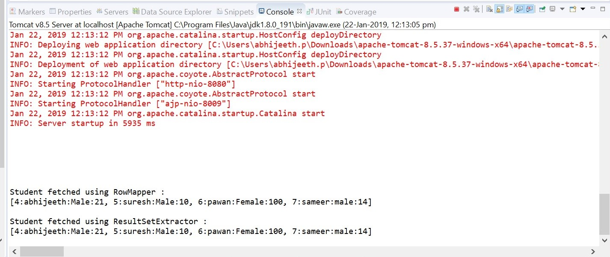
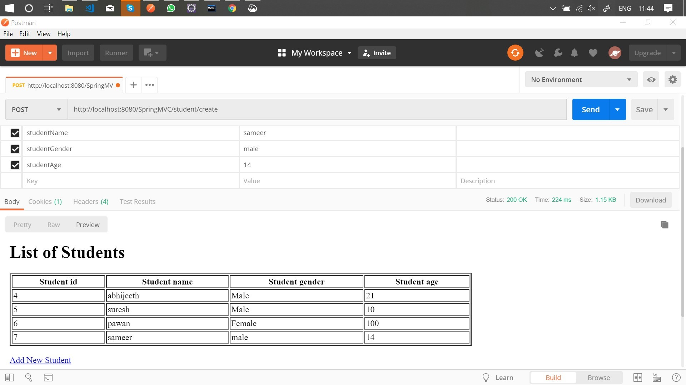
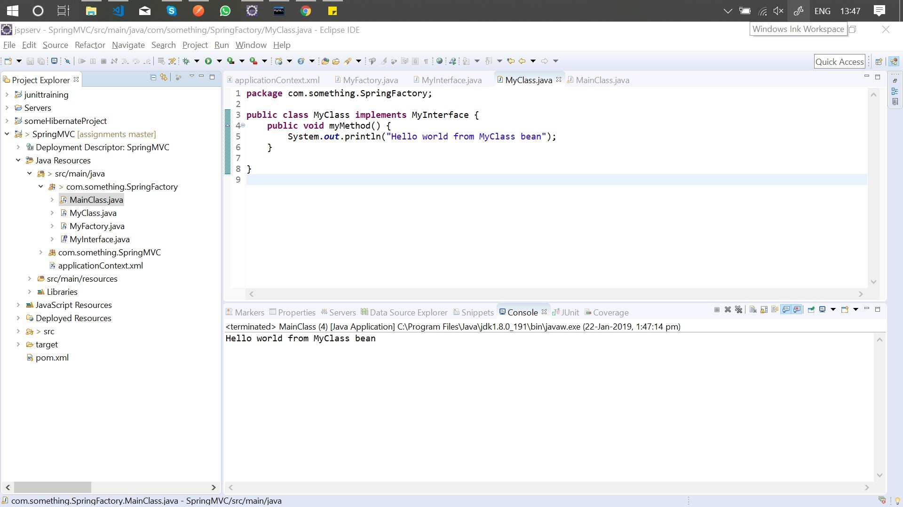

# SPRING MVC & JDBC ASSIGNMENT

## [SPRING JDBC](<"https://github.com/abhijeeth-accolite/assignments/tree/master/Assignment-18-01_(SPRING)/SpringMVC/src/main/java/com/something/SpringMVC">)

- Fetches students from student table using custom RowMapper.
- Fetches students from student table using custom ResultSetExtractor.

## [SPRING MVC](<"https://github.com/abhijeeth-accolite/assignments/tree/master/Assignment-18-01_(SPRING)/SpringMVC/src/main/java/com/something/SpringMVC">)

- contains controller layer and Data access layer
- inserts student from POST request sent to ".../student/create" route
- shows all students on GET request sent to ".../student/index" route

## [FACTORY METHODS](<"https://github.com/abhijeeth-accolite/assignments/tree/master/Assignment-18-01_(SPRING)/SpringMVC/src/main/java/com/something/SpringFactory">)

- Get a bean of MyClass using the factory method **getMyInterfaceObject**

