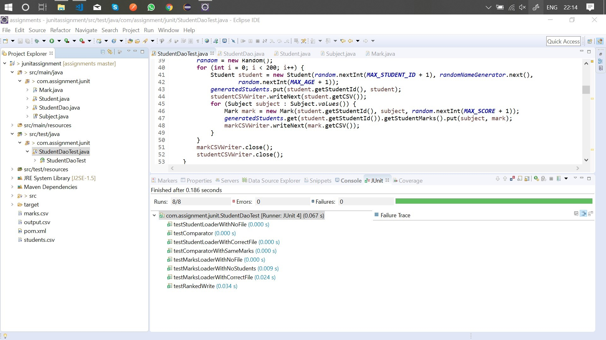
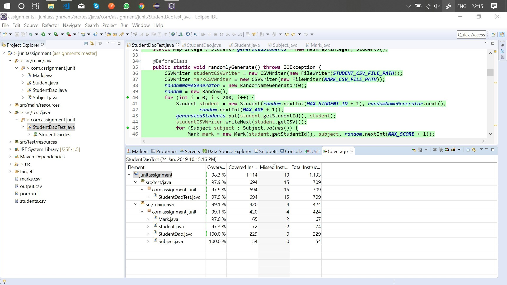

# JAVA UNIT TESTING ASSIGNMENT

## Output of StudentDaoTest

## coverage of StudentDaoTest

## input students.csv with students

`generated at random by StudentDaoTest`

`columns - <id, name, age>`

<a href = "./rankstudents/students.csv">students.csv</a>

## input marks.csv with marks

`generated at random by StudentDaoTest`

`columns - <studentId, subject, score>`

<a href = "./rankstudents/marks.csv">marks.csv</a>

## output output.csv with students and their ranks

`generated at runtime by StudentDao`

`columns - <rank, studentId, name, age>`

<a href = "./rankstudents/output.csv">output.csv</a>
